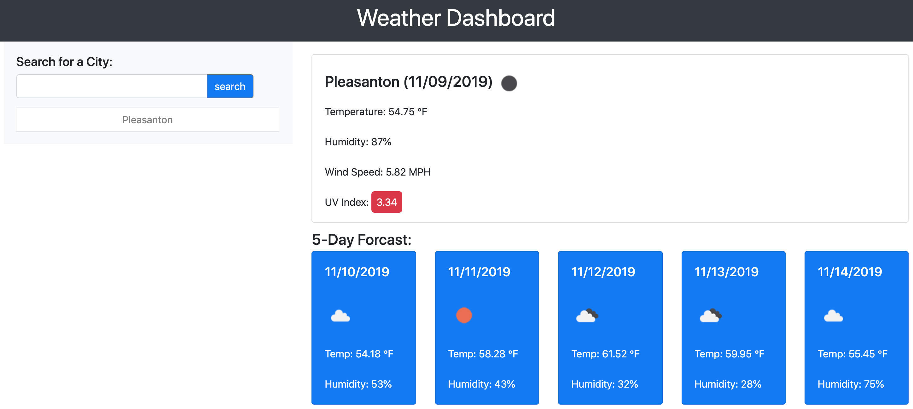

# WeatherDash

## Installation
To access this page, enter this URL into your address bar and follow the instructions provided:

## Usage

Given that the user is seeking information about current weather conditions and a 5 day weather forcast of a desired city, here are the directions on how to use this sites application service:

1.) The user can type the city name inside the input area and search for the city they want weather information on.

2.) Once the search button is pressed, a button with text of the city name they had in the input area will appear in the area below.

3.) The user can now press the button representing the desired city and current weather information and a five day forcast will appear.

## Current Weather Information

Through the process of completing this project, I was very keen on learning how to make .ajax calls to grab data from the OpenWeather API. In terms of website functionallity, this skill makes creating a website go beyond using just static data; it excites me that it is possible to apply potentially changing data that will dynamically change over time based off of variables outside of my input/control. I'm excited to find more api's to apply to my future projects!

    

    

